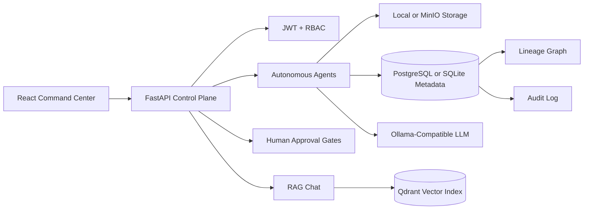

# Aegis AI v2.0

[](#)
[](#)
[](#)
[](#)

Aegis AI is a full-stack autonomous DataOps platform for governed data ingestion, quality validation, transformation, feature engineering, model workflows, explainability, deployment readiness, monitoring, lineage, approval gates, and RAG-assisted intelligence.

The repository contains both the FastAPI backend and the React command-center frontend.

## Product Capabilities

- Multi-agent orchestration for ingestion, schema, quality, feature, ML, explainability, deployment, monitoring, drift, transform, PII, and RAG workflows.
- Human approval gates for high-risk pipelines and checkpointed recovery.
- JWT authentication with role-based access control for Admin, Data Engineer, Analyst, and Viewer users.
- Data lineage graph APIs for upstream and downstream impact analysis.
- Audit logging for user actions, automated decisions, approvals, and security-sensitive events.
- Dark-mode React operations console with dashboard, pipelines, agents, chat, approvals, lineage, upload, monitoring, and admin screens.
- Docker Compose and Kubernetes manifests for production-oriented deployment.

## Repository Structure

```text
.
├── src/                    # FastAPI backend, agents, auth, database, storage, orchestration
├── tests/                  # E2E, security, load, and chaos tests
├── scripts/                # Milestone verification scripts
├── docs/                   # Architecture, API, deployment, security, and agent docs
├── k8s/                    # Kubernetes manifests
├── docker/                 # Supporting container configuration
├── alembic/                # Database migration scaffolding
├── aegis-frontend/         # React 18 + Vite + Tailwind frontend
├── docker-compose.yml      # Local service stack
└── README.md
```

## Backend Quick Start

```powershell
cd "C:\path\to\aegis-ai"
python -m pip install -r requirements.txt
copy .env.example .env
python scripts/verify_m5.py
uvicorn src.api.main:app --host 0.0.0.0 --port 8000 --reload
```

Health check:

```powershell
curl http://127.0.0.1:8000/health
```

API docs are available when the backend is running:

- Swagger UI: `http://127.0.0.1:8000/docs`
- ReDoc: `http://127.0.0.1:8000/redoc`

## Frontend Quick Start

```powershell
cd aegis-frontend
copy .env.example .env
pnpm install
pnpm run dev
```

Frontend URLs:

- App: `http://127.0.0.1:5174`
- Signup: `http://127.0.0.1:5174/signup`
- Login: `http://127.0.0.1:5174/login`

The frontend expects:

```text
VITE_API_URL=http://127.0.0.1:8000
VITE_WS_URL=ws://127.0.0.1:8000
```

## Full-Stack Local Run

Use two terminals.

```powershell
# Terminal 1: backend
cd "C:\path\to\aegis-ai"
uvicorn src.api.main:app --host 0.0.0.0 --port 8000 --reload
```

```powershell
# Terminal 2: frontend
cd "C:\path\to\aegis-ai\aegis-frontend"
pnpm run dev
```

Then open `http://127.0.0.1:5174/signup`, create a user, and sign in.

## Roles And Permissions

| Role | Capabilities |
| --- | --- |
| Admin | Full platform access, user management, audit review, approvals, agent execution |
| Data Engineer | Pipeline operation, approval decisions, agent execution, dataset workflows |
| Analyst | Intelligence, lineage, monitoring, and read-oriented workflows |
| Viewer | Read-only platform access |

Approval and agent-execution actions intentionally require Admin or Data Engineer permissions.

## Core API Groups

| Group | Purpose |
| --- | --- |
| `/auth` | Register, login, refresh, current user profile |
| `/agents` | List, status, and execute autonomous agents |
| `/approvals` | Pending approval list and approve/reject actions |
| `/chat` | RAG-assisted operational question answering |
| `/lineage` | Dataset lineage and impact analysis |
| `/datasets` | Dataset registration and metadata |
| `/admin` | Users, audit logs, retention controls |
| `/health` | Runtime health checks |

## Verification

Backend:

```powershell
python scripts/verify_m5.py
```

Frontend:

```powershell
cd aegis-frontend
pnpm run build
```

Current verified behavior includes:

- Backend health checks passing.
- Registration returns `201 Created`.
- JSON and OAuth-form login return JWT tokens.
- Protected `/auth/me` works with bearer tokens.
- Data Engineer users can execute agents and access approval endpoints.
- Frontend production build succeeds.

## Deployment

Docker Compose:

```powershell
docker compose up --build
```

Kubernetes:

```powershell
kubectl apply -k k8s/
kubectl -n aegis-ai get pods
```

## Architecture



## Security Notes

- Do not commit `.env`, database files, runtime logs, or generated build output.
- Use a strong `AEGIS_SECRET_KEY` outside local development.
- Keep CORS origins explicit when credentials are enabled.
- Viewer users cannot approve pipelines or execute agents by design.

## License

MIT. Adapt for private or commercial deployments with appropriate environment hardening and operational review.
