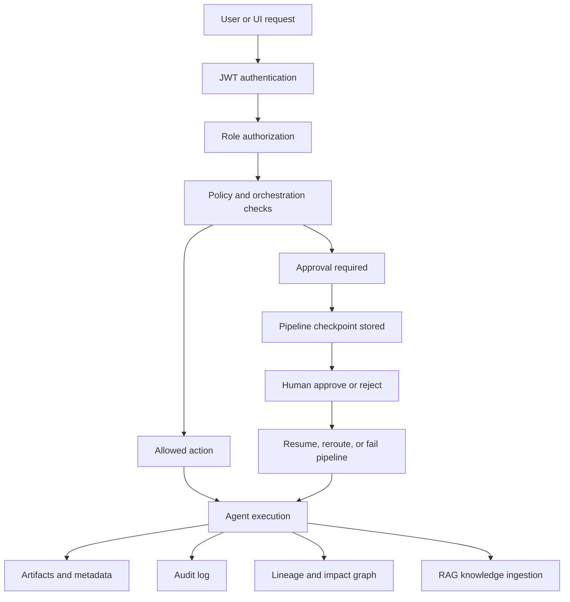
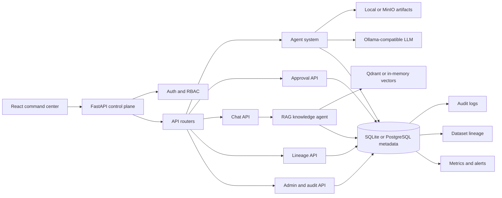
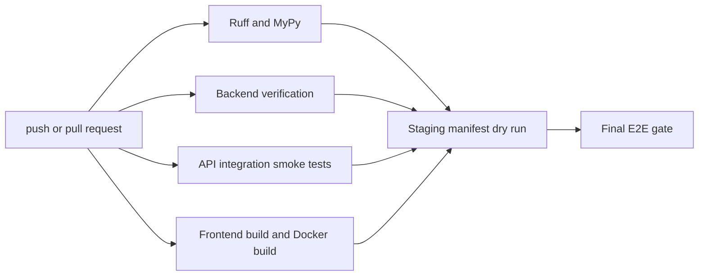

# AGIES AI

Governed agentic DataOps platform for running data and AI workflows with authentication, authorization, approval gates, lineage, audit records, and operational visibility around the agents that do the work.

[](https://github.com/vamshivardhan22/aegis-ai-fullstack/actions/workflows/ci-cd.yml)
[](https://fastapi.tiangolo.com/)
[](https://vite.dev/)
[](https://www.python.org/)

AGIES AI is a full-stack reference implementation for governed autonomous DataOps. It combines a FastAPI control plane, a React command center, SQLAlchemy metadata models, storage adapters, specialized agents, human approval APIs, lineage traversal, audit logging, PII detection, and RAG-backed operational chat.

The central idea is simple: agents can perform work, but the platform decides who is allowed to ask for that work, which actions need review, what evidence is retained, and how downstream impact is traced.

This repository contains both sides of the application:

- `src/`: FastAPI backend, agent implementations, RBAC, policies, storage, database models, and orchestration.
- `aegis-frontend/`: React, Vite, Tailwind command-center UI.
- `tests/`, `scripts/`, `.github/workflows/`: verification, E2E, security, load, and CI checks.
- `docker-compose.yml`, `Dockerfile`, `k8s/`: local and cluster-oriented deployment assets.

## Why AGIES?

Autonomous data workflows introduce a control problem. An agent may be able to ingest data, transform it, deploy a model wrapper, scan for drift, or answer operational questions, but those actions still need boundaries.

AGIES puts those boundaries in the application architecture:

- Identity determines who is making the request.
- RBAC determines whether the user can execute privileged actions.
- Policy and orchestration determine whether the workflow can continue or must pause.
- Human approval records decisions when risk is high.
- PII detection identifies sensitive columns before downstream use.
- Lineage explains where data came from and what could be affected.
- Audit logging records important user, system, and agent decisions.

The project is intentionally not autonomy without limits. It is autonomy with explicit control points.

## What AGIES Does

| Area | Current implementation |
| --- | --- |
| API control plane | FastAPI app with auth, agents, approvals, chat, admin, datasets, lineage, and health routers. |
| Authentication | Email/password registration, bcrypt password hashing, JWT login, token refresh, and `/auth/me`. |
| Authorization | Role checks for Admin, Data Engineer, Analyst, and Viewer users. Privileged routes use FastAPI dependencies. |
| Agent execution | Admin and Data Engineer users can execute registered agents through `/agents/{agent_type}/execute`. |
| Human approval | Pipelines in `approval_required` state can be listed, approved, rejected, and audited. Approval resumes checkpoint state. |
| PII detection | CSV sample scanning with column heuristics, regexes, optional spaCy, optional LLM fallback, masked examples, and alert creation. |
| Transform lineage | Transform agent writes a derived CSV artifact, creates a dataset record, and records dataset-to-dataset lineage. |
| RAG chat | Chat answers direct database questions when possible and falls back to a RAG knowledge agent backed by Qdrant or an in-memory fallback. |
| Audit logging | Registration, login, dataset operations, agent decisions, approval decisions, admin actions, and retention events use audit records. |
| Frontend | React command center with dashboard, pipelines, agents, chat, approvals, lineage, monitoring, upload, login, signup, and admin pages. |
| Deployment assets | Dockerfile, Docker Compose stack, and Kubernetes manifests are included and validated by CI/static checks. |

Some agent stages are deliberately lightweight compatibility stages. Ingestion, schema, quality, cleaning, features, and ML currently provide stable smoke-flow behavior through `CompatibilityAgent`; the deeper domain implementations are `TransformAgent`, `PIIDetectionAgent`, `ExplainAgent`, `DeployAgent`, `MonitorAgent`, `DriftAgent`, and `RAGKnowledgeAgent`.

## Governance Flow

The approval model is the strongest part of the project. A request does not go directly from user intent to execution. It passes through identity, role checks, policy-aware orchestration, and audit surfaces.



A high-risk workflow can be paused with checkpoint data in the `pipelines` table. The approval API records the human decision, updates pipeline state, writes an audit event, and ingests the decision into the knowledge base.

## Architecture



The backend separates metadata from artifacts. Metadata lives in relational tables: users, projects, datasets, pipelines, jobs, tasks, models, deployments, experiments, lineage, audit logs, alerts, documents, metrics, and schedules. Artifacts live in local storage for development or MinIO when configured.

The frontend is a Vite application that talks to the API with Axios, stores the bearer token in local storage, redirects unauthenticated users to login, and hides admin-only routes from non-admin users.

## Core Components

### Agent system

Agents inherit from `BaseAgent`, which provides artifact storage and decision logging. The API exposes the registered execution surface through `/agents`.

Current registered API agent types:

- `ingestion`, `schema`, `quality`, `cleaning`, `features`, `ml`: compatibility stage agents for smoke and orchestration flows.
- `transform`: pandas transformation generation, validation, execution, artifact storage, dataset creation, and lineage recording.
- `pii`: CSV sample PII detection and masking recommendations.
- `explain`: model/sample explanation support with SHAP-oriented behavior and fallback handling.
- `deploy`: generation of a FastAPI inference service artifact set for a trained model.
- `monitor`: health and prediction endpoint probing with metric and alert output.
- `drift`: baseline/current CSV comparison and drift report generation.

The RAG agent is used by the chat API and background ingestion helpers rather than being exposed directly as an `/agents/rag/execute` route in the current API registry.

### Authentication and RBAC

Security code lives in [src/core/security.py](src/core/security.py). Passwords are hashed with bcrypt through passlib. JWTs are signed with `AEGIS_SECRET_KEY` and include subject, role, user ID, and expiration.

Roles are defined in the database model as:

| Role | Notes |
| --- | --- |
| `admin` | Can access admin APIs, user management, audit browsing, approval actions, and agent execution. |
| `data_engineer` | Can upload/create datasets, execute agents, approve/reject pipelines, and record lineage. |
| `analyst` | Authenticated read-oriented role for surfaces such as chat and lineage reads. |
| `viewer` | Authenticated read-oriented default role. |

Route-level authorization is enforced with `require_role(...)` dependencies. A viewer can sign in and inspect allowed pages, but cannot approve pipelines or execute agents.

### Human approval

The approval router lists pipelines whose status is `approval_required`. Approving a pipeline sets it back to `running`, stores the latest decision in checkpoint data, writes a `HUMAN_DECISION` audit entry, ingests the decision into RAG knowledge, and attempts to resume from the checkpoint. Rejecting either fails the pipeline or routes it to an alternative action when one is supplied.

### PII, lineage, and audit

These are related parts of the governance story:

- PII detection identifies likely sensitive columns and produces masking recommendations without logging raw sample values.
- Governance and RBAC determine whether privileged actions are allowed.
- Approval handles decisions that require human authority.
- Lineage records dataset-to-dataset transformation edges and supports upstream, downstream, and impact queries.
- Audit logs retain who did what, to which resource, with before/after JSON, rationale, confidence, and timestamps.

Lineage traversal uses recursive SQL CTEs with an explicit depth cap. Impact analysis can connect downstream datasets to models and deployments when records exist.

### RAG and operational chat

The chat API first answers a small set of direct database-backed operational questions, such as dataset quality or failed pipeline status. If no direct answer is available, it calls `RAGKnowledgeAgent`, which embeds the question, searches vector results, loads matching documents, and asks the configured LLM to answer from that context.

Qdrant is used when reachable. Development and verification can still run with deterministic local fallbacks when the vector service or embedding service is unavailable.

### Monitoring and alerts

The backend includes alert and metric models. The monitor agent probes service endpoints, records latency/status behavior, and can create alerts for unhealthy services or threshold breaches. The repository also includes Prometheus and Grafana services in Docker Compose plus Kubernetes monitoring manifests.

## Example Workflow

A realistic AGIES flow looks like this:

1. A Data Engineer signs up or logs in and receives a JWT.
2. The user uploads or creates a dataset through `/datasets`.
3. The API stores metadata in the database and optional CSV content in the configured storage backend.
4. The user executes an agent, such as `pii`, `transform`, or `drift`.
5. RBAC confirms the user is allowed to perform the action.
6. The agent writes artifacts and logs decisions.
7. If a workflow reaches a high-risk gate, orchestration can place the pipeline in `approval_required` with checkpoint data.
8. An Admin or Data Engineer approves or rejects the pipeline through `/approvals` or the frontend approvals page.
9. The decision is audited and ingested into RAG knowledge.
10. Lineage and audit APIs provide traceability after the work completes.

## Technology Stack

| Layer | Technologies present in this repository |
| --- | --- |
| Backend | Python 3.11, FastAPI, Pydantic, SQLAlchemy asyncio, Alembic, Uvicorn |
| Data and ML | pandas, NumPy, scikit-learn, XGBoost, LightGBM, SHAP, MLflow |
| Governance | JWT, bcrypt/passlib, RBAC dependencies, audit tables, approval APIs, retention policy helpers |
| AI/RAG | Ollama-compatible LLM client, Qdrant client, deterministic embedding fallback |
| Storage | Local filesystem adapter and MinIO adapter |
| Frontend | React 18, Vite, Tailwind CSS, React Router, Axios, Recharts, lucide-react |
| Infrastructure | Docker, Docker Compose, Kubernetes manifests, Traefik, Prometheus, Grafana, Redis, PostgreSQL |
| Verification | Ruff, MyPy, pytest, Locust, GitHub Actions |

## Quick Start

### Prerequisites

- Python 3.11
- Node.js 20
- pnpm 9 or compatible pnpm release
- Docker Desktop, if using Docker Compose
- kubectl, if applying Kubernetes manifests

### Clone

```bash
git clone https://github.com/vamshivardhan22/aegis-ai-fullstack.git
cd aegis-ai-fullstack
```

### Backend: local SQLite mode

```bash
python -m venv .venv
# Windows PowerShell
.\.venv\Scripts\Activate.ps1
# macOS/Linux
# source .venv/bin/activate

python -m pip install --upgrade pip
pip install -r requirements.txt
copy .env.example .env
# macOS/Linux: cp .env.example .env

python scripts/verify_m5.py
uvicorn src.api.main:app --host 0.0.0.0 --port 8000 --reload
```

Health check:

```bash
curl http://127.0.0.1:8000/health
```

Interactive API documentation is available while the backend is running:

- Swagger UI: `http://127.0.0.1:8000/docs`
- ReDoc: `http://127.0.0.1:8000/redoc`

### Frontend

In a second terminal:

```bash
cd aegis-frontend
pnpm install
copy .env.example .env
# macOS/Linux: cp .env.example .env
pnpm run dev -- --host 127.0.0.1 --port 5174
```

Open:

- App: `http://127.0.0.1:5174`
- Signup: `http://127.0.0.1:5174/signup`
- Login: `http://127.0.0.1:5174/login`

The default frontend environment file points at the local API:

```text
VITE_API_URL=http://127.0.0.1:8000
VITE_WS_URL=ws://127.0.0.1:8000
```

### Docker Compose

Docker Compose starts the backend and supporting services. It does not start the React dev server.

```bash
cp .env.example .env
# Windows PowerShell: copy .env.example .env
docker compose up --build
```

Useful checks:

```bash
curl http://127.0.0.1:8000/health
docker compose ps
docker compose logs -f aegis-api
```

Compose services include PostgreSQL, Redis, MinIO, MLflow, Ollama, Qdrant, Prometheus, Grafana, Traefik, and the API.

## Configuration

Runtime settings are defined in [src/config.py](src/config.py) and loaded from environment variables or `.env`. Start from [.env.example](.env.example).

Important backend settings:

| Variable | Purpose |
| --- | --- |
| `AEGIS_ENV` | `development`, `staging`, or `production`. |
| `AEGIS_DB_URL` | Async SQLAlchemy database URL. Defaults to SQLite. |
| `AEGIS_STORAGE_BACKEND` | `local` or `minio`. |
| `AEGIS_LOCAL_STORAGE_PATH` | Local artifact directory for development. |
| `AEGIS_MINIO_ENDPOINT` | MinIO endpoint when object storage is enabled. |
| `AEGIS_REDIS_URL` | Redis URL used by the stack configuration. |
| `AEGIS_MLFLOW_TRACKING_URI` | MLflow tracking URI. |
| `AEGIS_OLLAMA_URL` | Ollama-compatible LLM endpoint. |
| `AEGIS_LLM_MODEL` | Chat/generation model name. |
| `AEGIS_EMBEDDING_MODEL` | Embedding model name. |
| `AEGIS_QDRANT_URL` | Qdrant vector database URL. |
| `AEGIS_QDRANT_COLLECTION` | Vector collection name. |
| `AEGIS_SECRET_KEY` | JWT signing secret. Replace the example value outside local development. |
| `AEGIS_ACCESS_TOKEN_EXPIRE_MINUTES` | JWT lifetime in minutes. |
| `AEGIS_HUMAN_APPROVAL_RISK_THRESHOLD` | Risk threshold used by governance/orchestration checks. |

Do not commit `.env`, local databases, logs, generated artifacts, `node_modules`, `.venv`, or frontend build output.

## API Overview

The FastAPI application exposes these router groups:

| Group | Endpoints |
| --- | --- |
| Health | `GET /health` |
| Auth | `POST /auth/register`, `POST /auth/login`, `GET /auth/me`, `POST /auth/refresh` |
| Agents | `GET /agents/`, `GET /agents/{agent_type}/status`, `POST /agents/{agent_type}/execute` |
| Approvals | `GET /approvals/pending`, `GET /approvals/{pipeline_id}`, `POST /approvals/{pipeline_id}/approve`, `POST /approvals/{pipeline_id}/reject` |
| Chat | `POST /chat/ask`, `GET /chat/history` |
| Datasets | `POST /datasets/`, `POST /datasets/upload`, `GET /datasets/{dataset_id}` |
| Lineage | `GET /lineage/datasets/{dataset_id}`, `GET /lineage/pipelines/{pipeline_id}`, `GET /lineage/impact/{dataset_id}`, `POST /lineage/record` |
| Admin | `GET /admin/users`, `PUT /admin/users/{user_id}/role`, `DELETE /admin/users/{user_id}`, `GET /admin/audit-logs` |

Example registration and login:

```bash
curl -X POST http://127.0.0.1:8000/auth/register \
  -H "Content-Type: application/json" \
  -d '{"email":"engineer@example.com","password":"SecurePass123","full_name":"Data Engineer","role":"data_engineer"}'

curl -X POST http://127.0.0.1:8000/auth/login \
  -H "Content-Type: application/json" \
  -d '{"email":"engineer@example.com","password":"SecurePass123"}'
```

Example authenticated dataset creation:

```bash
curl -X POST http://127.0.0.1:8000/datasets/ \
  -H "Authorization: Bearer TOKEN" \
  -H "Content-Type: application/json" \
  -d '{"name":"orders","source_type":"csv","content":"id,email,amount\n1,a@example.com,10\n"}'
```

## Verification

The repository has several verification paths. Use the ones that match the change you are making.

```bash
python -m ruff check src --no-cache
python -m mypy src --no-error-summary
python -m pytest tests/e2e -q
python -m pytest tests/e2e/test_security.py -q
python scripts/verify_m5.py
```

Frontend build:

```bash
cd aegis-frontend
pnpm install --frozen-lockfile
pnpm run build
```

Load-test assets are under [tests/load](tests/load/) and are validated by the M5 verifier through Locust import/list checks.

`python scripts/verify_m5.py` is a broad project verifier. It chains previous milestone checks, E2E tests, security tests, load-test discovery, Docker asset validation or Docker build when available, Kubernetes manifest validation, documentation checks, CI job checks, Ruff, and MyPy.

## CI/CD

The GitHub Actions workflow lives in [.github/workflows/ci-cd.yml](.github/workflows/ci-cd.yml). It runs on pushes and pull requests to `main`.



Workflow jobs:

| Job | What it does |
| --- | --- |
| `lint` | Installs Python dependencies, runs Ruff and MyPy. |
| `unit-test` | Runs `python scripts/verify_m5.py`. |
| `integration-test` | Runs `python -m pytest tests/e2e -q`. |
| `build` | Installs frontend dependencies, builds Vite app, builds Docker image without pushing. |
| `deploy-staging` | Validates expected deployment files exist on push events. |
| `e2e-test` | Runs final E2E tests after the staging dry run. |

## Deployment

### Dockerfile

The root [Dockerfile](Dockerfile) builds a Python 3.11 slim image, installs dependencies, copies backend source and Alembic files, runs migrations at container start, and starts Uvicorn on port 8000.

### Docker Compose

[docker-compose.yml](docker-compose.yml) defines the API and supporting local services. It is useful for integration testing and local environments where you want PostgreSQL, Redis, MinIO, MLflow, Ollama, Qdrant, Prometheus, Grafana, and Traefik running together.

### Kubernetes

The [k8s](k8s/) directory contains a Kustomize base with namespace, config map, secret template, PostgreSQL, Redis, MinIO, API deployment, ingress, and monitoring manifests.

```bash
kubectl apply -k k8s/
kubectl -n aegis-ai get pods
```

Before using the manifests outside a local or test cluster, replace the example secret values and image reference. The API manifest currently uses `ghcr.io/example/aegis-ai:latest` as a placeholder image.

## Repository Structure

```text
.
|-- .github/workflows/ci-cd.yml   # GitHub Actions pipeline
|-- Dockerfile                    # Backend container image
|-- docker-compose.yml            # API plus local backing services
|-- pyproject.toml                # Ruff and MyPy configuration
|-- requirements.txt              # Python dependencies
|-- src/
|   |-- api/                      # FastAPI app and routers
|   |-- agents/                   # Agent implementations
|   |-- core/                     # Security, policies, rate limiting, logging
|   |-- database/                 # SQLAlchemy models, sessions, repositories
|   |-- llm/                      # LLM client
|   |-- orchestrator/             # Pipeline state machine and checkpoint handling
|   `-- storage/                  # Local and MinIO storage adapters
|-- aegis-frontend/               # React command center
|-- tests/                        # E2E, security, chaos, and load tests
|-- scripts/                      # Milestone verification scripts
|-- docs/                         # Architecture, API, deployment, security, agent docs
|-- alembic/                      # Migration environment
|-- k8s/                          # Kubernetes manifests
`-- docker/                       # Traefik config
```

## Design Principles Reflected in the Code

- Place authorization before privileged execution.
- Keep approval decisions explicit and auditable.
- Separate metadata from artifacts.
- Preserve lineage for data transformations.
- Prefer safe fallback behavior for optional AI/vector services in development.
- Treat PII detection, audit logs, and retention as governance primitives, not UI features.
- Verify claims through code, tests, CI, and documented commands.

## Current Status

AGIES AI currently provides a working backend API, React frontend, local SQLite mode, Docker Compose integration stack, Kubernetes manifests, CI workflow, and verification scripts. It is suitable for development, demos, architecture review, and continued engineering work on governed agentic DataOps patterns.

The repository should not be treated as a compliance certification or turnkey production deployment. Before operating it with real sensitive data, review secrets, TLS, identity provider integration, database backup/restore, observability, network policy, object-storage policy, audit retention, and deployment-specific controls.

Known development-oriented areas:

- OAuth/OIDC and SAML functions are stubs, not configured identity-provider integrations.
- Several pipeline stages are compatibility agents rather than full domain agents.
- Kubernetes manifests include placeholders that must be replaced for a real environment.
- RAG and embedding behavior can fall back locally when Qdrant or Ollama is unavailable.

## Roadmap

Useful next steps for the project:

- Replace compatibility stages with deeper ingestion, schema, quality, feature, and ML agents.
- Add first-class OAuth/OIDC integration and external identity provider configuration.
- Move long-running agent execution behind a queue or worker model.
- Expand policy evaluation beyond role and threshold checks.
- Add frontend integration tests for critical approval and auth flows.
- Add migration versions for schema evolution beyond automatic SQLite table creation.
- Harden Kubernetes overlays for specific cloud environments.
- Add documented backup, restore, and incident-response runbooks.

## Security

Report security issues privately rather than opening a public issue with exploit details. If this repository is used in a private deployment, route reports through the owning team until a public policy is added.

Operational guidance:

- Replace `AEGIS_SECRET_KEY` in every non-local environment.
- Do not commit real `.env` files or generated databases.
- Use TLS at ingress or reverse proxy boundaries.
- Store production secrets in Kubernetes Secrets, GitHub Actions Secrets, or a managed secret store.
- Keep CORS origins explicit when credentials are enabled.
- Rotate credentials and deactivate affected users after suspected compromise.
- Review `/admin/audit-logs` and preserve database/object-storage snapshots during incident response.

AGIES includes application-level controls, but those controls do not replace infrastructure hardening, secure network design, dependency review, or formal compliance assessment.

## Contributing

For changes to backend code, run:

```bash
python -m ruff check src --no-cache
python -m mypy src --no-error-summary
python -m pytest tests/e2e -q
```

For frontend changes, run:

```bash
cd aegis-frontend
pnpm install --frozen-lockfile
pnpm run build
```

Keep pull requests focused. Update docs when behavior changes. Do not commit secrets, local databases, virtual environments, dependency directories, or generated build output.

## License

No license file is currently present in this repository. Add a `LICENSE` file before distributing or reusing the project outside its current ownership context.
