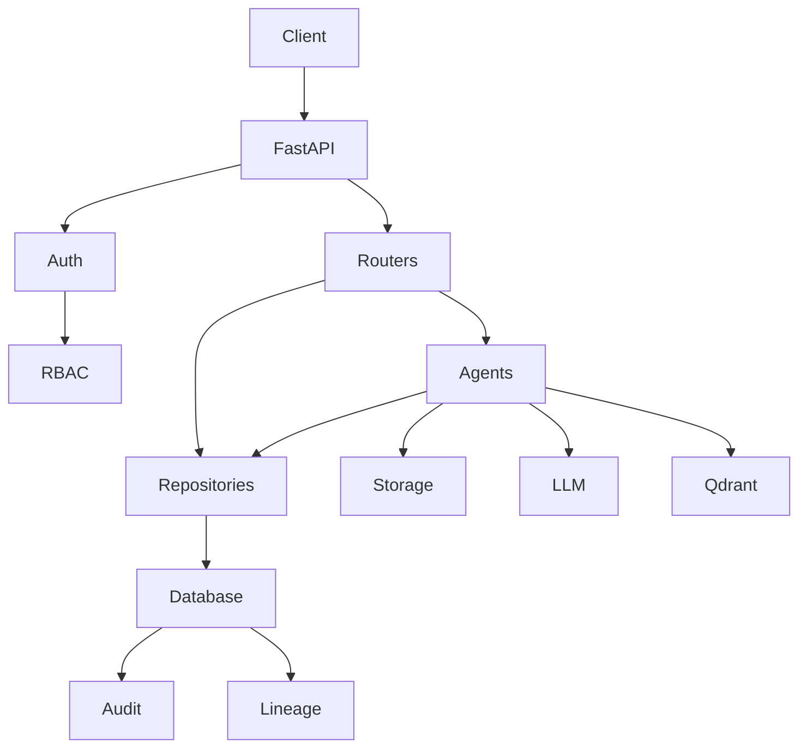

# Architecture

Aegis AI is organized as a control plane for autonomous DataOps. The API layer receives requests, authenticates users, checks role permissions, starts agents, records lineage, and exposes operational status. The metadata layer stores durable state about users, projects, datasets, pipelines, jobs, tasks, models, deployments, experiments, lineage, audit logs, alerts, documents, metrics, and schedules. The artifact layer stores CSV samples, model packages, generated deployment files, PII reports, drift reports, and explanation documents in local storage for development or MinIO in production. The intelligence layer uses an Ollama-compatible chat and embedding service for agent reasoning and a Qdrant-compatible vector index for retrieval augmented generation.

The system follows a deliberate separation between metadata and artifacts. Metadata records are small, queryable, auditable, and suitable for relational consistency. Artifacts can be large, binary, or lifecycle-managed separately. A dataset record may point to a bronze, silver, or gold object path. A model record may point to a serialized estimator. A deployment generated by the deployment agent writes service code, Dockerfile, and requirements files as storage artifacts. This keeps the database focused on governance while storage handles bytes.

Agents inherit a shared base class that provides artifact storage and decision logging. Specialized agents handle explainability, deployment packaging, monitoring, drift detection, transformation, RAG knowledge, and PII detection. Compatibility agents provide stable stages for ingestion, schema, cleaning, features, and ML smoke flows, allowing pipeline orchestration and load tests to exercise a complete path while full domain agents evolve independently. Agent calls are intentionally asynchronous and return JSON-compatible dictionaries so routers, orchestrators, and tests can compose them without framework-specific coupling.

The orchestration module models a pipeline as state. The graph moves through ingest, schema, quality gate, clean, transform gate, features, ML, explain, deploy gate, deploy, and monitor. Low quality or high risk routes to human approval. The human approval node checkpoints state in `pipelines.checkpoint_data`, and the approval API can resume or reject that state. This design was chosen because operational pipelines need interruption, inspection, and recovery rather than fire-and-forget execution. LangGraph influenced the state-machine design, and a real MemorySaver is attached when the package is installed.

Security is enforced at the router boundary. `/health` is public for load balancers. Auth endpoints register, log in, refresh, and return current profile information. Agent execution and approvals require admin or data engineer roles. Chat and lineage reads require any authenticated user. Admin routes require the admin role. Validation errors are normalized into consistent JSON with `detail` and `code` fields, so clients can handle unauthorized and forbidden responses predictably.

Lineage is stored as dataset-to-dataset edges. Recursive CTEs compute upstream and downstream graphs in the database rather than walking relationships in application code. That choice matters when production graphs grow large: the database optimizer can handle recursive traversal, depth limits are explicit, and impact analysis can join downstream datasets to models and deployments. Retention policies operate as soft deletes, marking data as archived and logging audit entries instead of hard-deleting records.

Deployment options intentionally cover two maturity levels. Docker Compose starts the full local stack, including PostgreSQL, Redis, MinIO, MLflow, Ollama, Prometheus, Grafana, Qdrant, Traefik, and the API. Kubernetes manifests provide namespace, config map, secret template, stateful backing services, API deployment, HPA, ingress, and monitoring resources. Compose is optimized for developer speed; Kubernetes is optimized for horizontal scaling, probes, resource limits, and production rollout discipline.
